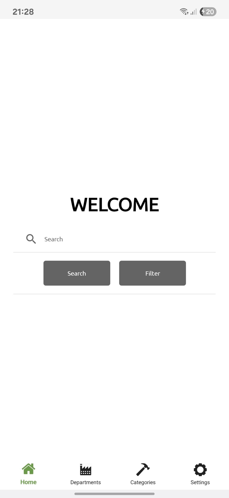
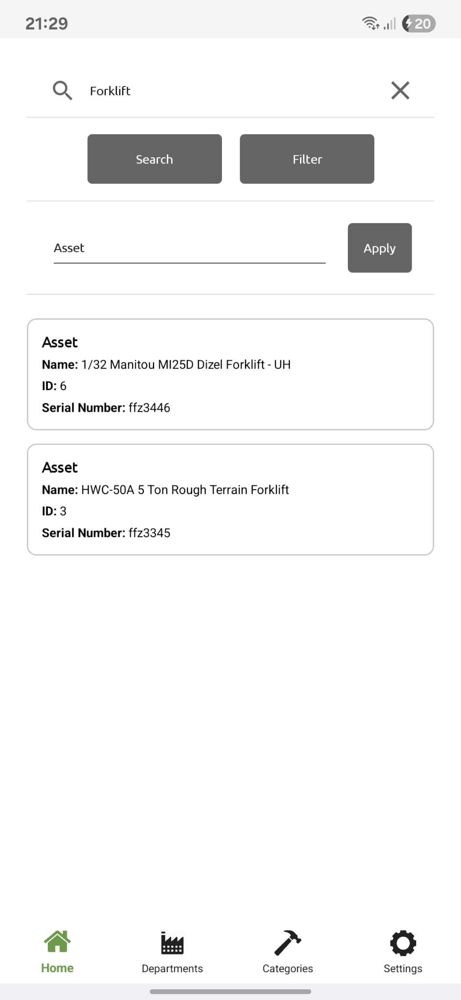
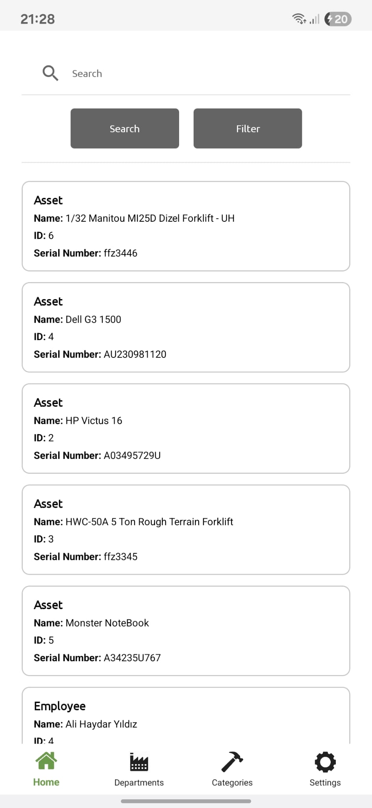
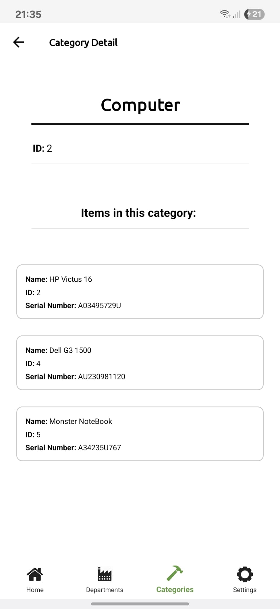
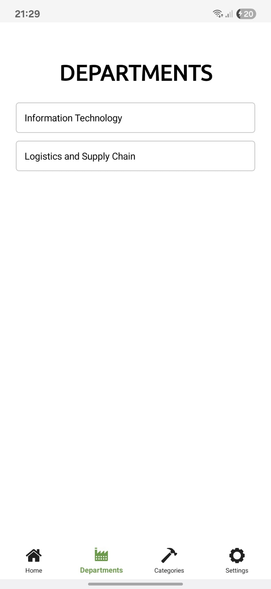
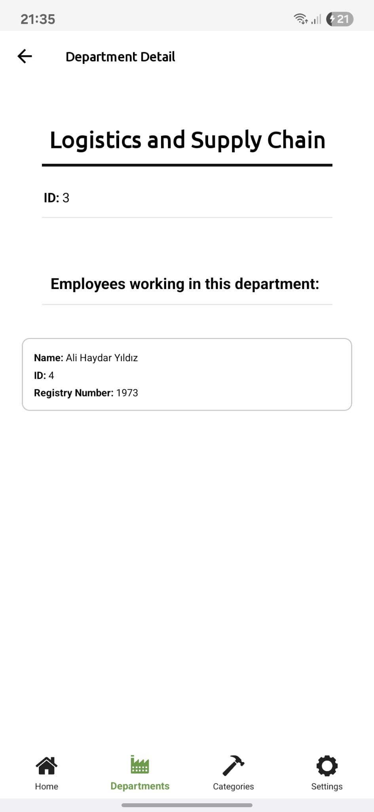
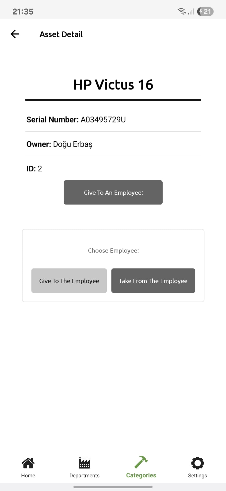
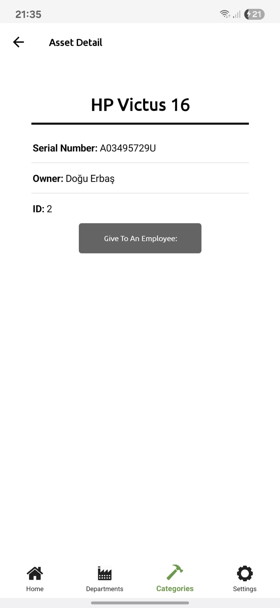

### 🇬🇧 English

# 🧾 Project Overview

**Asset Management** System is a mobile and web-based solution developed during my internship.
It allows factories or organizations to assign assets (devices, tools, equipment) to employees and track their usage in real time.
The system includes both a .NET MAUI mobile app and an ASP.NET Core Web API backend.

---

### 🧩 Features

- 👷 **Employee Management** — Add, update, and list employees

- 🧰 **Asset Tracking** — Assign assets to employees, track returns and conditions

- 🔍 **Search & Filter** — Quickly find assets or employees by name or ID

- 📱 **Mobile App (MAUI)** — Easy-to-use interface for field staff

- 🌐 **API (ASP.NET Core)** — RESTful backend for data management

- 💾 **Database Integration** — SQL Server-based data persistence

- 🔐 **User-friendly structure** — Clean MVVM and Repository architecture

---

### 🏗️ Tech Stack

- **Frontend:** .NET MAUI
- **Backend:** ASP.NET Core Web API
- **Database:** Microsoft SQL Server
- **Architecture:** MVMM + Repository Pattern
- **Language:** C#
- **Tools:** Visual Studio 2022, SQL Server Management Studio 21, GitHub

---

### 📸 Screenshots

#### 📱 Mobile Interface

<table>
  <tr>
    <td></td>
    <td></td>
    <td></td>
    <td></td>
  </tr>
  <tr>
    <td></td>
    <td></td>
    <td></td>
    <td></td>
  </tr>
</table>

---

### 🚀 How to Run

1. **Clone the repository:**

```bash
git clone https://github.com/dou186f/assetManagementProject.git
```

2. **Note:**
-The API is currently under development and not connected to a live server.
-You can connect it to your own local server and test it using a simple dummy database.

3. **Run the Mobile Application:**
-Open the project in your IDE (e.g., Visual Studio).
-Build and run the mobile application on an emulator or a real device.

4. **Testing with the API locally:**
-Configure the API base URL in the mobile app to point to your local development server.
-Make sure the dummy database contains the necessary tables and sample data to test the app features.

---

### 💡 Future Improvements

-Adding authentication (login system)
-Generating reports (PDF or Excel)
-Notifications for asset returns

---

### 🧑‍💻 Author

Doğu Erbaş
📧 [doguerbass@gmail.com]  
💼 Developed as an internship project.

---

### 🇹🇷 Türkçe

# 🧾 Proje Özeti

**Varlık Yönetimi (Asset Management)** Sistemi, staj sırasında geliştirilen mobil ve web tabanlı bir çözümdür.  
Fabrikalar veya organizasyonlar, çalışanlara cihaz, araç veya ekipman gibi varlıkları atayabilir ve kullanım durumlarını gerçek zamanlı olarak takip edebilir.  
Sistem, bir .NET MAUI mobil uygulaması ve bir ASP.NET Core Web API backend içerir.

---

### 🧩 Özellikler

- 👷 **Çalışan Yönetimi** — Çalışan ekleme, güncelleme ve listeleme

- 🧰 **Varlık Takibi** — Varlıkları çalışanlara atama, iade ve durum takibi

- 🔍 **Arama & Filtreleme** — Varlıkları veya çalışanları isim veya ID ile hızlıca bulma

- 📱 **Mobil Uygulama (MAUI)** — Sahadaki personel için kullanıcı dostu arayüz

- 🌐 **API (ASP.NET Core)** — Veri yönetimi için RESTful backend

- 💾 **Veritabanı Entegrasyonu** — SQL Server tabanlı veri saklama

- 🔐 **Kullanıcı dostu yapı** — Temiz MVVM ve Repository mimarisi

---

### 🏗️ Teknoloji Yığını

- **Frontend:** .NET MAUI
- **Backend:** ASP.NET Core Web API
- **Veritabanı:** Microsoft SQL Server
- **Mimari:** MVVM + Repository Pattern
- **Programlama Dili:** C#
- **Araçlar:** Visual Studio 2022, SQL Server Management Studio 21, GitHub

---

### 📸 Ekran Görüntüleri

#### 📱 Mobil Arayüz

<table>
  <tr>
    <td></td>
    <td></td>
    <td></td>
    <td></td>
  </tr>
  <tr>
    <td></td>
    <td></td>
    <td></td>
    <td></td>
  </tr>
</table>

---

### 🚀 Çalıştırma Talimatları

1. **Depoyu Klonlayın:**

```bash
git clone https://github.com/dou186f/assetManagementProject.git
```

2. **Not:**
-API şu anda geliştirme aşamasında ve canlı sunucuya bağlı değil.
-Kendi yerel sunucunuza bağlayarak basit bir dummy veritabanı ile test edebilirsiniz.

3. **Mobil Uygulamayı Çalıştırma:**
-Projeyi IDE’de (örn. Visual Studio) açın.
-Mobil uygulamayı emulator veya gerçek cihaz üzerinde çalıştırın.

4. **API’yi Yerelde Test Etme:**
-Mobil uygulamadaki API base URL’ini kendi yerel geliştirme sunucunuza yönlendirin.
-Dummy veritabanının gerekli tablolar ve örnek veriler içerdiğinden emin olun.

---

### 💡 Gelecek İyileştirmeler

-Kimlik doğrulama ekleme (login sistemi)
-Rapor oluşturma (PDF veya Excel)
-Varlık iade bildirimleri

---
### 🧑‍💻 Yazar

Doğu Erbaş
📧 [doguerbass@gmail.com]  
💼 Staj projesi olarak geliştirilmiştir.
